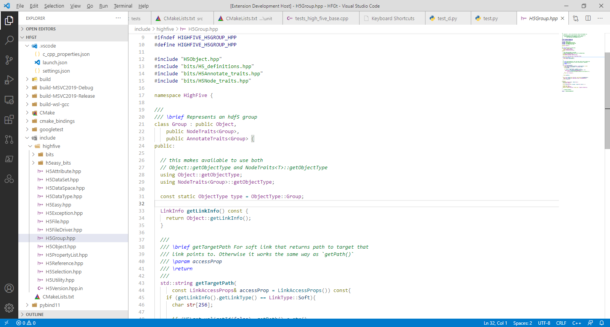

# QtCreator's default color theme for VS Code

## Installation
1. Open the extensions sidebar on Visual Studio Code
2. Search for "QtCreator's default color theme"
3. Click Install
4. Click Reload to reload your editor
5. Select the Manage Cog (bottom left) > Color Theme ＞ QtCreator's default color theme

## Note
In some cases this theme can't correctly color the text. 